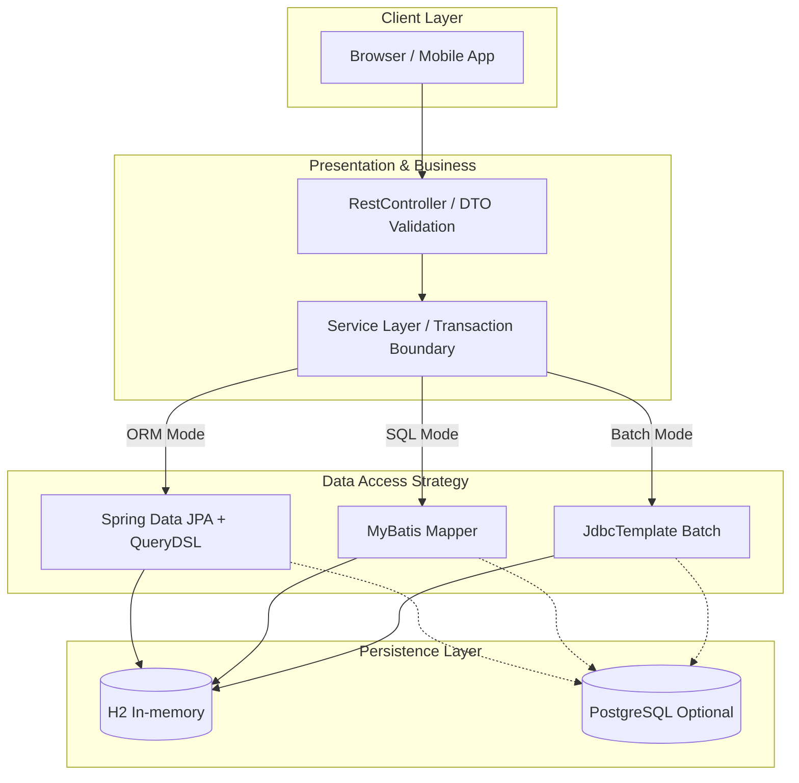

<div align="center">


<h3>🗄️ Enterprise Data Access Patterns, Query Optimization, and Transaction Reliability Lab</h3>

<p>
  
  
  
  
  
</p>

<p>
  
  
  
</p>

</div>

---

> JPA, QueryDSL, MyBatis, JdbcTemplate의 장단점을 비교하고 상황별 데이터 접근 전략을 검증하는 백엔드 데이터 아키텍처 레퍼런스입니다.  
> N+1 방어, bulk insert 성능, cursor pagination, 동시성 제어를 코드와 테스트로 증명합니다.

---

## 📌 Problem — 왜 만들었는가

- **ORM 성능 병목**: JPA는 생산성이 높지만 N+1, bulk 처리, 복잡 쿼리에서 쉽게 병목이 발생합니다.
- **SQL 제어권 부족**: 복잡한 통계, 조인, 튜닝 상황에서는 SQL을 직접 다루는 전략이 필요합니다.
- **대용량 데이터 처리 한계**: offset paging과 반복 insert는 데이터가 커질수록 성능이 급격히 저하됩니다.
- **동시성 리스크**: 동시에 같은 데이터를 수정하면 lost update와 일관성 문제가 발생할 수 있습니다.

Database Master Lab은 데이터 접근 기술을 하나의 정답으로 고정하지 않고, 업무 상황에 맞게 선택하는 기준을 코드로 제시합니다.

## 🏗️ Architecture — 어떻게 설계했는가



## 📂 Project Structure

```text
database-master-lab/
├── .github/workflows/ci.yml                   # ⚙️ Java 21 기반 CI 파이프라인
├── src/main/java/com/hooney/lab/database/
│   ├── config/                                # ⚙️ QueryDSL, DB, transaction 설정
│   ├── domain/                                # 🧩 User, Post 등 Rich Domain Entity
│   ├── dto/                                   # 📦 API Request/Response DTO 경계
│   └── repository/                            # 🗄️ 데이터 접근 전략 비교 계층
│       ├── jpa/                               # 🍃 Spring Data JPA + QueryDSL
│       ├── mybatis/                           # 🧾 MyBatis Mapper + XML SQL
│       └── jdbc/                              # ⚡ JdbcTemplate bulk/batch 최적화
├── src/main/resources/
│   ├── mapper/                                # 🧾 MyBatis SQL mapper XML
│   └── application.yml                        # ⚙️ H2/PostgreSQL, JPA, batch size 설정
├── src/test/java/com/hooney/lab/database/
│   └── repository/                            # 🧪 N+1, bulk insert, lock, paging 검증
├── docs/                                      # 📚 데이터 접근 철학 및 트러블슈팅
├── Dockerfile                                 # 🐳 Java 21 컨테이너 빌드 환경
└── build.gradle                               # 🧰 QueryDSL, MyBatis, JDBC 의존성 관리
```

## 🎯 Key Features & Evidence — 무엇을 증명하는가

### 1. DTO Boundary Separation

| Feature | Description |
| :--- | :--- |
| **Request/Response DTO** | Entity 내부 구조를 API 스펙에서 분리 |
| **Validation Boundary** | `@NotBlank`, `@Email` 등 입력 검증을 DTO 계층에서 처리 |
| **Factory Method** | Entity와 DTO 변환 규칙을 명시적으로 관리 |

**Evidence**

- API 계층이 Entity를 직접 노출하지 않도록 DTO 경계를 유지합니다.
- 도메인 변경이 외부 API 응답 구조에 즉시 전파되지 않도록 결합도를 낮춥니다.

### 2. Multi-access Data Strategy

| Technology | Best Use Case | Implementation |
| :--- | :--- | :--- |
| **JPA / QueryDSL** | 일반 CRUD, 동적 검색, 도메인 중심 조회 | `UserQueryRepository` |
| **MyBatis** | 복잡한 조인, 통계, SQL 튜닝 중심 업무 | `UserMyBatisMapper` |
| **JdbcTemplate** | bulk insert/update, 저수준 성능 최적화 | `UserJdbcRepository` |

**Evidence**

- 같은 도메인 문제를 여러 데이터 접근 방식으로 해결하며 선택 기준을 비교합니다.
- 업무 성격에 따라 ORM 생산성과 SQL 제어권을 분리해 사용할 수 있음을 보여줍니다.

### 3. Query Optimization & Pagination

| Scenario | Baseline | Optimized | Evidence |
| :--- | :--- | :--- | :--- |
| 1:N relation fetch | N+1 발생 가능 | Fetch Join / Batch Size | `UserNPlusOneTest` |
| Bulk Insert 10,000 rows | JPA `saveAll()` 약 3500ms | JdbcTemplate `batchUpdate()` 약 150ms | `BulkInsertPerformanceTest` |
| Large Pagination | Offset 성능 저하 | Cursor Paging | `PagingOptimizationTest` |
| Dynamic Search | 문자열 조합 위험 | QueryDSL type-safe query | `QueryDSLDynamicQueryTest` |

**Evidence**

- N+1 방어, 대량 삽입, cursor pagination을 테스트로 검증합니다.
- 단순 기능 구현이 아니라 데이터가 커졌을 때의 성능 저하를 기준으로 설계를 비교합니다.

### 4. Transaction & Concurrency Defense

| Risk | Strategy | Evidence |
| :--- | :--- | :--- |
| Lost Update | `@Version` 기반 optimistic lock | `OptimisticLockTest` |
| Transaction leakage | Service layer transaction boundary | Integration test |
| Bulk update inconsistency | Persistence context clear strategy | Repository test |

**Evidence**

- 100개 스레드 동시 접근 상황에서 낙관적 락 기반 충돌 감지를 검증합니다.
- 대량 수정과 영속성 컨텍스트 간 불일치 가능성을 명시적으로 다룹니다.

## 🚀 Quick Start — 어떻게 실행하는가

### Docker Compose with PostgreSQL

```bash
git clone https://github.com/hooneyg/database-master-lab.git
cd database-master-lab

docker-compose up -d --build
docker-compose logs -f
```

### Single Docker Container with H2

```bash
docker build -t database-master-lab:latest .
docker run -p 8080:8080 database-master-lab:latest
```

## 🧪 Tests — 어떻게 검증했는가

```bash
./gradlew test
```

| Test | What It Proves |
| :--- | :--- |
| `UserNPlusOneTest` | 1:N 관계 조회에서 N+1 방어 |
| `BulkInsertPerformanceTest` | JPA와 JdbcTemplate bulk insert 성능 비교 |
| `OptimisticLockTest` | 동시 수정 시 lost update 방어 |
| `PagingOptimizationTest` | offset 대비 cursor pagination 성능 안정성 |
| `QueryDSLDynamicQueryTest` | 다양한 검색 조건의 type-safe 동적 쿼리 생성 |

## 🧭 Roadmap

- [ ] Redis cache strategy 보강
- [ ] Index tuning report 추가
- [ ] Transaction isolation examples 추가
- [ ] Bulk insert/update benchmark report 문서화
- [ ] Slow query 분석 문서 추가

## 🔗 Related Labs

| Related Lab | 연결 이유 |
| :--- | :--- |
| `infra-master-lab` | 데이터 계층을 운영 환경에 배포하기 위한 인프라 기준 |
| `security-auth-core` | 사용자, 권한, 세션 데이터의 보안 기준 |
| `event-streaming-lab` | Outbox, 처리 이력, 이벤트 저장소 기준 |
| `realtime-comm-lab` | 채팅, 세션, 연결 상태 저장 기준 |
| `ai-agent-brain-lab` | 로그, 벡터, 상태 저장소 성능 기준 |

## 📚 Documentation

- [Tech Wiki: Data Access Philosophy](./docs/README.md)
- [Troubleshooting Guide](./docs/troubleshooting.md)

## 📄 License

This project is licensed under the [MIT License](./LICENSE).

---

<div align="center">
<b>Built by <a href="https://github.com/hooneyg">Hooney</a> — AI FullStack Developer & Enterprise Solution Architect</b>


</div>
