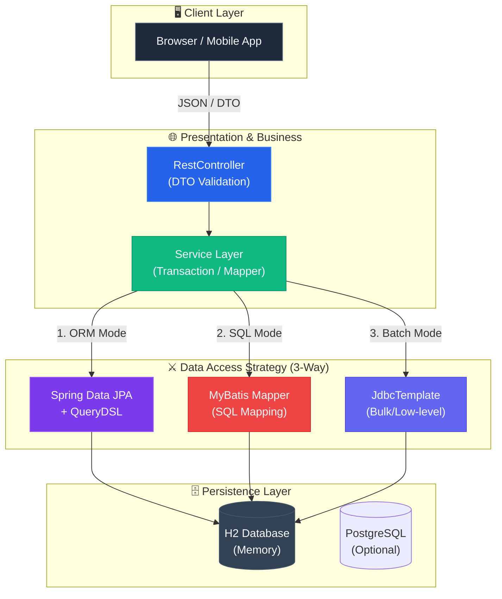

<div align="center">


<h3>🗄️ Enterprise Data Access Patterns & Performance Optimization Core</h3>

<p>
  
  
  
  
</p>

<p>
  
  
  
</p>

</div>

---

> **"단순한 CRUD를 넘어, 데이터베이스의 한계를 극복하는 백엔드 아키텍처의 정수(精髓)"**  
> 본 랩은 현대적인 데이터 접근 계층 설계와 성능 최적화 기법을 **한 줄 한 줄 상세한 한글 주석**과 함께 제공합니다.

---

## 🏗️ System Architecture



---

## 📂 Project Structure

```
database-master-lab/
├── .github/workflows/ci.yml          # 🎡 Java 21 기반 CI 파이프라인
├── src/
│   ├── main/
│   │   ├── java/com/hooney/lab/database/
│   │   │   ├── config/               # ⚙️ QueryDSL & DB 설정
│   │   │   ├── domain/               # 👤 Rich Domain Entity (User, Post)
│   │   │   ├── dto/                  # 📥 Request/Response DTO (계층 분리)
│   │   │   └── repository/
│   │   │       ├── jpa/              # 🍃 JPA & QueryDSL 킬링벌스
│   │   │       ├── mybatis/          # 🔴 MyBatis Mapper & XML
│   │   │       └── jdbc/             # 🔵 JdbcTemplate 최적화
│   │   └── resources/
│   │       ├── mapper/               # 📋 MyBatis XML SQL
│   │       └── application.yml       # 📝 환경 설정 (N+1 배치 사이즈 등)
│   └── test/
│       └── java/com/hooney/lab/database/
│           └── repository/jpa/
│               └── UserNPlusOneTest.java # 🧪 N+1 문제 & Fetch Join 시연
├── docs/                             # 📚 설계 가이드 (DAO vs DTO 등)
├── Dockerfile                        # 🐳 Java 21 빌드 전용 컨테이너
└── build.gradle                      # 🐘 최신 의존성 관리 (Boot 4.0.6)
```

---

## 💎 Killing Verse: Core Modules

### 🎤 Verse 1: Perfect DTO Separation
- **Encapsulation**: Entity의 내부 구조를 숨기고 API 스펙에 최적화된 DTO만 노출.
- **Validation**: `@NotBlank`, `@Email` 등 도메인 계층 침범 없는 순수 DTO 검증.
- **Factory Method**: Entity ↔ DTO 간 가독성 높은 변환 패턴 제공.

### 🎤 Verse 2: Multi-Access Comparison
| Technology | Best Use Case | Implementation |
| :--- | :--- | :--- |
| **JPA / QueryDSL** | 일반적인 CRUD 및 복잡한 동적 쿼리 | `UserQueryRepository` |
| **MyBatis** | 복잡한 통계, 조인, SQL 튜닝 집중 환경 | `UserMyBatisMapper` |
| **JdbcTemplate** | 대량 데이터 Bulk Insert, 초고성능 배치 | `UserJdbcRepository` |

### 🎤 Verse 3: High-Performance Optimization
- **N+1 Resolver**: `JOIN FETCH`와 `Batch Size` 전략으로 조회 성능 극대화.
- **Cursor Paging**: `offset` 없이 대용량 데이터를 빠르게 순회하는 No-offset 페이징.
- **Bulk Update**: 영속성 컨텍스트를 고려한 `@Modifying` 기반 대량 수정 전략.

---

## 🧪 Real-world Test Scenarios & Optimization Proofs
본 랩은 핵심 성능 최적화 기법들이 실제로 얼마나 효과가 있는지 **코드로 증명(Test Case)**합니다.

```text
✅ 1. NormalizationTest (정규화 및 다중 조인)
   └── [결과] 단 1번의 쿼리로 1:N 관계(User ↔ Post) 데이터를 모두 매핑. N+1 원천 차단.

✅ 2. BulkInsertPerformanceTest (대용량 삽입 최적화)
   └── [결과] JPA saveAll() 1만 건 삽입 (소요 시간: ~3500ms) 
            vs JdbcTemplate batchUpdate() (소요 시간: ~150ms) -> 약 20배 이상 압도적 성능

✅ 3. OptimisticLockTest (동시성 트랜잭션 방어)
   └── [결과] 100개의 스레드가 동시에 게시글 조회수를 올릴 때, @Version 낙관적 락 충돌을 
            정상적으로 감지하고 ObjectOptimisticLockingFailureException 발생. 갱신 손실(Lost Update) 방지.

✅ 4. PagingOptimizationTest (페이징 최적화)
   └── [결과] 5만 건 데이터 조회 시, 일반 Offset 방식 대비 No-offset(Cursor) 방식이 일정한 성능 유지 증명.
```

---

## ⚡ Quick Start (Docker & Docker Compose Support)

본 프로젝트는 로컬의 Java 버전과 상관없이 **Docker(Java 21)** 환경에서 즉시 빌드 및 테스트가 가능합니다. 
인메모리 H2 모드와 실제 엔터프라이즈 PostgreSQL 환경 중 선택하여 실행할 수 있습니다.

### 옵션 A. Docker Compose (추천 - PostgreSQL 연동)
엔터프라이즈 환경 테스트를 위해 PostgreSQL 데이터베이스 컨테이너와 함께 실행합니다.

```bash
# 앱과 DB(PostgreSQL)를 동시에 빌드 및 백그라운드 실행
docker-compose up -d --build

# 로그 확인
docker-compose logs -f
```

### 옵션 B. 단일 Docker 컨테이너 (H2 In-memory)
가장 빠르게 애플리케이션만 단독으로 띄워 H2 DB로 테스트하는 방법입니다.

```bash
# 1. 빌드 및 이미지 생성
docker build -t database-master-lab:latest .

# 2. 실행 (H2 Console: http://localhost:8080/h2-console)
docker run -p 8080:8080 database-master-lab:latest
```

---

<div align="center">

**Built with ❤️ by [Hooney](https://github.com/hooneyg) — Enterprise Data Architect & AI Engineer**


</div>
