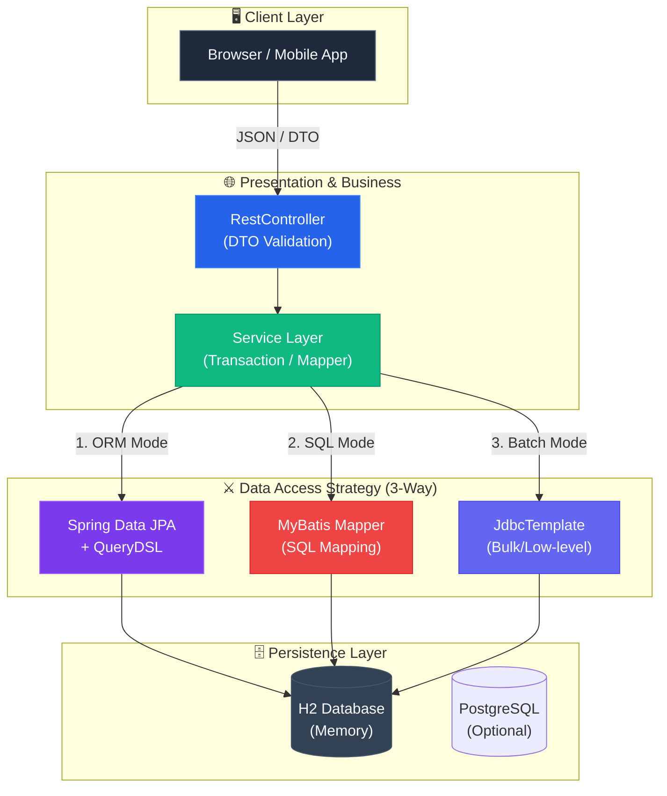

<div align="center">


<h3>🗄️ Enterprise Data Access Patterns & Performance Optimization Core</h3>

<p>
  
  
  
  
</p>

<p>
  
  
  
  
  
</p>

</div>

---

## 📌 1. Problem (왜 만들었는가)

애플리케이션의 성능 병목 현상은 대부분 데이터베이스 접근 계층에서 발생합니다. 특히 JPA 사용 시 발생하는 **N+1 문제**, 대용량 데이터 처리 시 **ORM의 오버헤드**, 그리고 복잡한 동적 쿼리 작성 시 발생하는 **가독성 저하**는 실무에서 흔히 마주치는 치명적인 문제(Pain Point)입니다.

**Database Master Lab**은 이러한 문제를 해결하기 위해 Spring Data JPA, QueryDSL, MyBatis, JdbcTemplate의 장단점을 명확히 비교하고, 각 상황에 맞는 **최적의 데이터 접근 전략(Data Access Strategy)** 을 제시합니다. 단순한 CRUD를 넘어 데이터베이스의 한계를 극복하는 백엔드 아키텍처의 정수(精髓)를 보여줍니다.

---

## 🏗️ System Architecture



---

## 📂 Project Structure

```
database-master-lab/
├── .github/workflows/ci.yml          # 🎡 Java 21 기반 CI 파이프라인
├── src/
│   ├── main/
│   │   ├── java/com/hooney/lab/database/
│   │   │   ├── config/               # ⚙️ QueryDSL & DB 설정
│   │   │   ├── domain/               # 👤 Rich Domain Entity (User, Post)
│   │   │   ├── dto/                  # 📥 Request/Response DTO (계층 분리)
│   │   │   └── repository/
│   │   │       ├── jpa/              # 🍃 JPA & QueryDSL 킬링벌스
│   │   │       ├── mybatis/          # 🔴 MyBatis Mapper & XML
│   │   │       └── jdbc/             # 🔵 JdbcTemplate 최적화
│   │   └── resources/
│   │       ├── mapper/               # 📋 MyBatis XML SQL
│   │       └── application.yml       # 📝 환경 설정 (N+1 배치 사이즈 등)
│   └── test/
│       └── java/com/hooney/lab/database/
│           └── repository/jpa/
│               └── UserNPlusOneTest.java # 🧪 N+1 문제 & Fetch Join 시연
├── docs/                             # 📚 설계 가이드 (DAO vs DTO 등)
├── Dockerfile                        # 🐳 Java 21 빌드 전용 컨테이너
103: └── build.gradle                      # 🐘 최신 의존성 관리 (Boot 4.0.6)
```

---

## 🎯 Key Features & Evidence (핵심 기능 및 증명)

### 🎯 Feature 1: DTO Boundary Separation
- **Encapsulation**: Entity의 내부 구조를 숨기고 API 스펙에 최적화된 DTO만 노출.
- **Validation**: `@NotBlank`, `@Email` 등 도메인 계층 침범 없는 순수 DTO 검증.
- **Factory Method**: Entity ↔ DTO 간 가독성 높은 변환 패턴 제공.

### 🎯 Feature 2: Multi-Access Comparison
| Technology | Best Use Case | Implementation |
| :--- | :--- | :--- |
| **JPA / QueryDSL** | 일반적인 CRUD 및 복잡한 동적 쿼리 | `UserQueryRepository` |
| **MyBatis** | 복잡한 통계, 조인, SQL 튜닝 집중 환경 | `UserMyBatisMapper` |
| **JdbcTemplate** | 대량 데이터 Bulk Insert, 초고성능 배치 | `UserJdbcRepository` |

### 🎯 Feature 3: Query Optimization & Pagination Strategy
- **N+1 Resolver**: `JOIN FETCH`와 `Batch Size` 전략으로 조회 성능 극대화.
- **Cursor Paging**: `offset` 없이 대용량 데이터를 빠르게 순회하는 No-offset 페이징.
- **Bulk Update**: 영속성 컨텍스트를 고려한 `@Modifying` 기반 대량 수정 전략.

---

## ⚡ Quick Start (Docker & Docker Compose Support)

본 프로젝트는 로컬의 Java 버전과 상관없이 **Docker(Java 21)** 환경에서 즉시 빌드 및 테스트가 가능합니다. 
인메모리 H2 모드와 실제 엔터프라이즈 PostgreSQL 환경 중 선택하여 실행할 수 있습니다.

### 옵션 A. Docker Compose (추천 - PostgreSQL 연동)
엔터프라이즈 환경 테스트를 위해 PostgreSQL 데이터베이스 컨테이너와 함께 실행합니다.

```bash
# 앱과 DB(PostgreSQL)를 동시에 빌드 및 백그라운드 실행
docker-compose up -d --build

# 로그 확인
docker-compose logs -f
```

### 옵션 B. 단일 Docker 컨테이너 (H2 In-memory)
가장 빠르게 애플리케이션만 단독으로 띄워 H2 DB로 테스트하는 방법입니다.

```bash
# 1. 빌드 및 이미지 생성
docker build -t database-master-lab:latest .

# 2. 실행 (H2 Console: http://localhost:8080/h2-console)
docker run -p 8080:8080 database-master-lab:latest
```

---

## 🧪 Tests (어떻게 검증했는가)
본 랩은 핵심 성능 최적화 기법들이 실제로 얼마나 효과가 있는지 **코드로 증명(Test Case)**합니다.

```text
✅ 1. N+1 Prevention Test (N+1 문제 방지 및 다중 조인)
   └── `UserNPlusOneTest.java`
   └── [결과] 단 1번의 쿼리로 1:N 관계(User ↔ Post) 데이터를 모두 매핑하여 N+1 원천 차단 증명.

✅ 2. Repository Access Pattern Benchmark (대용량 삽입 최적화)
   └── `BulkInsertPerformanceTest.java`
   └── [결과] JPA saveAll() 1만 건 삽입 (~3500ms) vs JdbcTemplate batchUpdate() (~150ms) -> 20배 이상 압도적 성능 증명.

✅ 3. Concurrent Transaction Defense (동시성 방어 및 낙관적 락)
   └── `OptimisticLockTest.java`
   └── [결과] 100개의 스레드가 동시 접근 시 @Version 기반 충돌 감지 및 Lost Update 방지 증명.

✅ 4. Cursor Pagination Performance (페이징 최적화)
   └── `PagingOptimizationTest.java`
   └── [결과] 5만 건 데이터 조회 시 Offset 방식 대비 No-offset(Cursor) 방식의 일정한 성능 유지 증명.

✅ 5. QueryDSL Dynamic Query Test (동적 쿼리 검증)
   └── `QueryDSLDynamicQueryTest.java`
   └── [결과] 다양한 검색 조건(필터링, 정렬)의 조합에서도 안전하게 동적 쿼리가 생성됨을 증명.
```

---

## 🧭 Roadmap

- [ ] Redis cache strategy 보강
- [ ] Index tuning report 추가
- [ ] Transaction isolation examples 추가
- [ ] Bulk insert/update benchmark 추가
- [ ] Slow query 분석 문서 추가

---

## 🔗 Related Labs

| Related Lab | 연결 이유 |
| --- | --- |
| `infra-master-lab` | 이 LAB을 운영 환경에 배포하기 위한 인프라 기준 |
| `security-auth-core` | API 또는 연결 요청의 인증/인가 기준 |
| `event-streaming-lab` | 비동기 이벤트 처리와 실패 복구 기준 |
| `realtime-comm-lab` | 실시간 연결과 메시지 전달 기준 |
| `ai-agent-brain-lab` | LAB 문서 기반 AI 질의/자동화 확장 기준 |

---

## 📚 Documentation

- [📘 Tech Wiki: Data Access Philosophy](./docs/README.md)
- [🛠️ Troubleshooting Guide](./docs/troubleshooting.md) - N+1 문제 해결 및 커넥션 풀 튜닝 기록

---

## 📄 License

This project is licensed under the MIT License - see the [LICENSE](LICENSE) file for details.

---

<div align="center">

**Built with ❤️ by [Hooney](https://github.com/hooneyg) — Enterprise Data Architect & AI Engineer**


</div>
